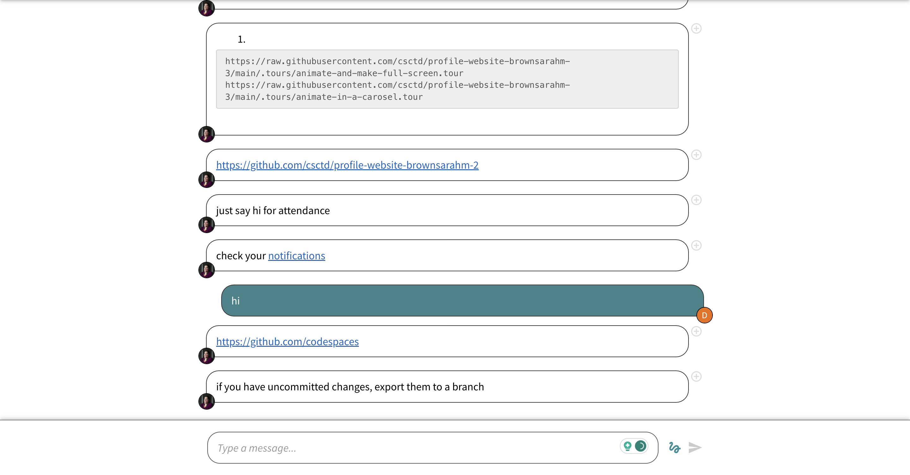

# TD Summer

<div id="slideshow">


```{include} _static/buttons.html
```


````{card-carousel} 2


```{card}
:class-card: slide


+++
hadgspgouaefwgluiadfs

```

```{card}
:class-card: slide


```


```{card}
:class-card: slide


```

```{card}
:class-card: slide


```

```{card}
:class-card: slide


```

```{card}
:class-card: slide


```

```{card}
:class-card: slide


```

```{card}
:class-card: slide


```

```{card}
:class-card: slide


```

```{card}
:class-card: slide


```

```{card}
:class-card: slide


```

```{card}
:class-card: slide


```

```{card}
:class-card: slide


```

```{card}
:class-card: slide


```

```{card}
:class-card: slide


```

```{card}
:class-card: slide


```

```{card}
:class-card: slide


```

```{card}
:class-card: slide


```

```{card}
:class-card: slide


```

```{card}
:class-card: slide


```

```{card}
:class-card: slide


```

```{card}
:class-card: slide


```


````

</div>
